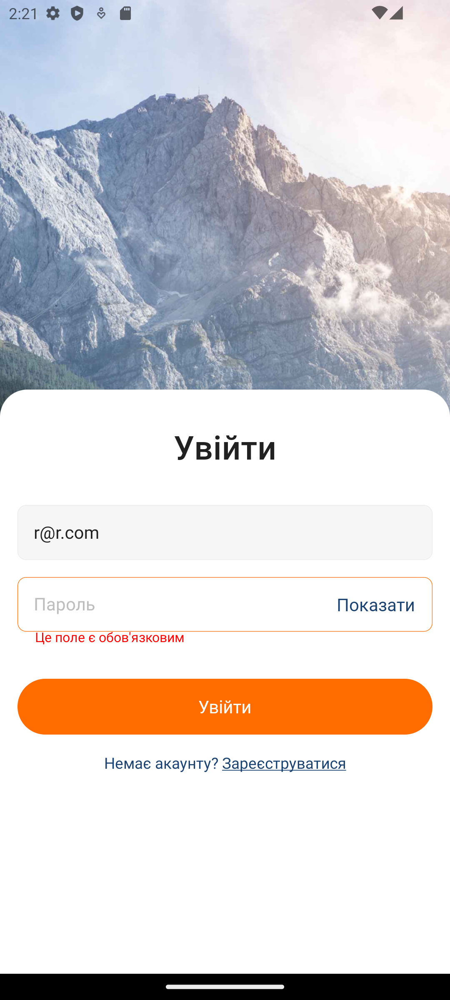
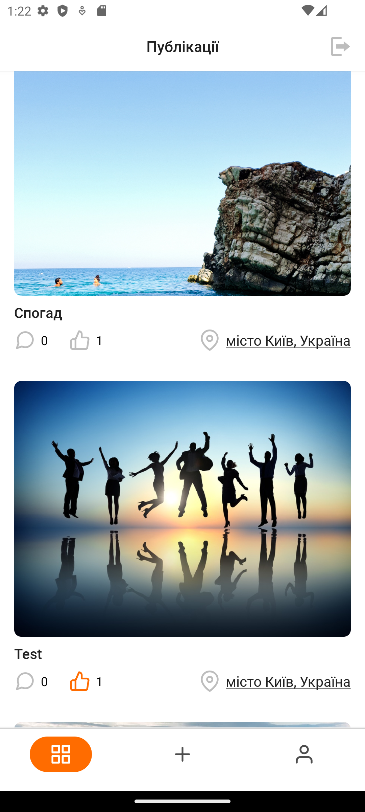
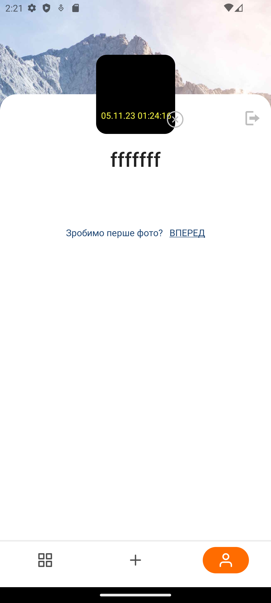
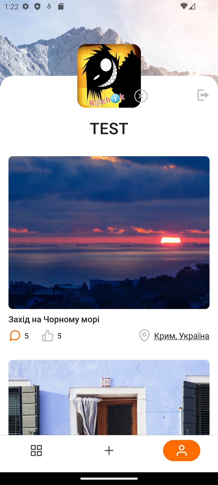
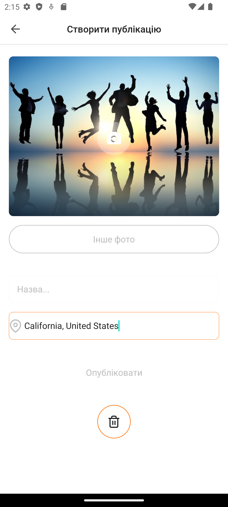
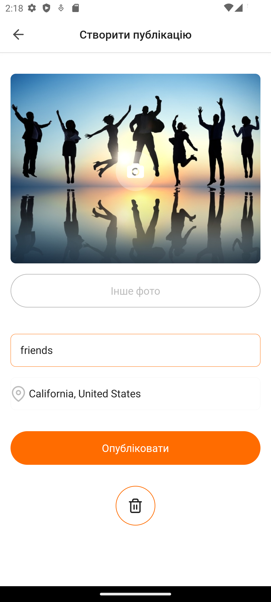
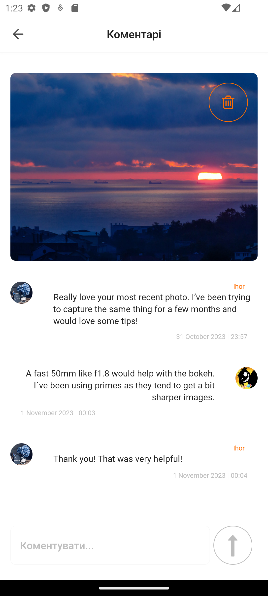
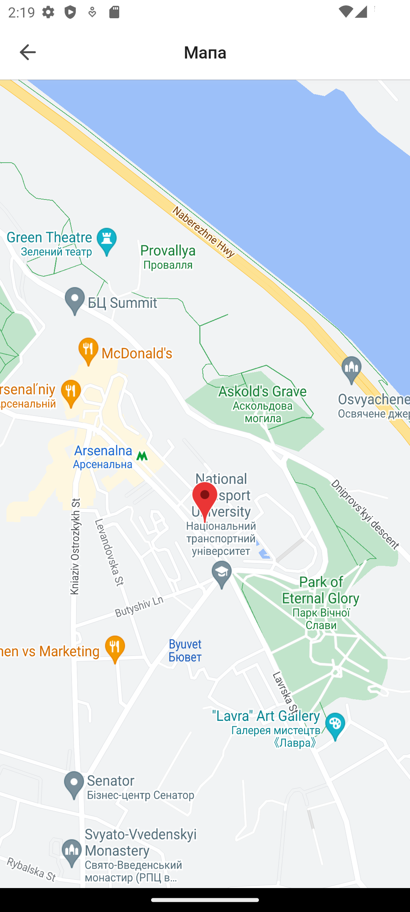

# Social Network App

A social network platform where users can share photos, comment on posts, and interact with other
users. The app is built using React Native for the frontend and Firebase for the backend. Firebase is
used for user authentication and data storage.

## Technologies Used

&nbsp;React&nbsp;Native
&nbsp;Expo&nbsp;
&nbsp;Firebase&nbsp;
&nbsp;Redux&nbsp;

## Features

- Photo uploading and sharing
- User authentication (Firebase)
- Commenting on posts
- Like functionality
- Setting user profile photos
- Viewing and deleting own photos
- Viewing geolocation of photos
- Taking photos or selecting from device gallery for posts

## Screenshots

